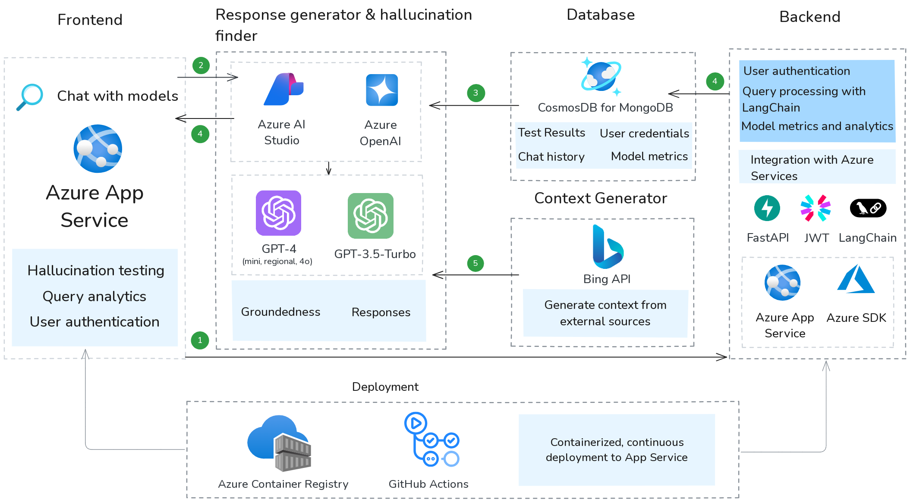

<div>


</div>
<br/>

# FAITH : Framework for AI Integrity and Testing Hallucinations
FAITH is an Azure AI based web application which is used to find hallucinations and ensure integrity among various AI models and LLMs along with confident scores, complete reasoning, detailed analytics and visualizations by comparing with external knowledge sources.
Multiple model support(gpt-4, gpt-4o, gpt-4o-mini, gpt-35-turbo-16k, etc.,), True and False negatives and positives, user friendly interface, detailed analytics, ready to use hosted platform are some of the unique selling points of our solution.
It is completely built on using Azure technologies like Azure App Service, Azure OpenAI, Bing Search API, Azure AI Evaluators, Azure Cosmos DB, Azure AI Foundry, Azure Container Registry, etc.,

<a href="https://faith-cyfzeshhbjcdefhb.eastus2-01.azurewebsites.net/" target="_blank">
  
</a>
&nbsp;&nbsp;&nbsp;&nbsp;&nbsp;&nbsp;&nbsp;&nbsp;&nbsp;&nbsp;
<a href="https://github.com/KierthanaRS/FAITH" target="_blank">
  
</a>
&nbsp;&nbsp;&nbsp;&nbsp;&nbsp;&nbsp;&nbsp;&nbsp;&nbsp;&nbsp;
<a href="https://www.youtube.com/yourchannel" target="_blank">
  
</a>
&nbsp;&nbsp;&nbsp;&nbsp;&nbsp;&nbsp;&nbsp;&nbsp;&nbsp;&nbsp;
<a href="https://www.example.com/yourpresentation" target="_blank">
  
</a>
<br/><br/>

**Key Features:**
- Multiple model support (e.g., GPT-4, GPT-4o, GPT-4o-mini, GPT-35-Turbo-16k, and custom LLMs).
- User-friendly interface with hosted platform access.
- Detailed analytics for AI evaluation metrics, including hallucination percentages.
- Confusion matrix showing true/false positives and negatives.
- Integration with Azure technologies for seamless scalability and reliability.

---

## **Table of Contents**
1. [Azure Technologies Used](#azure-technologies-used)
2. [Development](#development)
3. [Team Members](#team-members)
4. [Problem Statement](#problem-statement)
5. [Architecture](#architecture)
6. [Tech Stack](#tech-stack)
7. [Features](#features)

---

## **Azure Technologies Used**

- **Azure App Service:** Hosts the FAITH application, ensuring scalability and secure deployment. 
- **Azure Cosmos DB:** Serves as the backend database for storing user data, chat history, and analytics.
- **Azure OpenAI:** Integrates Azure-hosted GPT models for robust language understanding and output generation.
- **Azure AI Foundry:** Manages the orchestration of multiple LLMs for efficient processing.
- **Azure AI Services:** Enhances the application with pre-built AI capabilities like sentiment analysis and anomaly detection.
- **Azure Bing Search API:** Provides external knowledge sources for validating AI-generated content.
- **Azure Container Registry:** Streamlines the deployment process by managing Docker containers for both the frontend and backend.
- **Azure AI Evaluators:** Ensures the detection of bias, violence, or other issues in AI outputs.
- **Azure Cognitive Services:** Powers natural language understanding and computer vision features for enhanced analytics.

---

## **Development**

FAITH is structured as a **monorepo**, organized as follows:
- **Frontend:** Built using Next.js for a dynamic and user-friendly web interface.
- **Backend:** RESTful APIs developed with Python and FastAPI.

**Prerequisites:**
- [Docker](https://www.docker.com/) and Docker Compose for containerized development.

**Steps to Run Locally:**
1. Verify Docker and Docker Compose are installed:
   ```shell
   docker -v
   docker compose version
   ```
2. Clone the repository and set up environment variables:
   ```shell
   git clone https://github.com/KierthanaRS/FAITH
   cd FAITH
   touch frontend/.env
   touch backend/.env
   ```
3. Build and start the services:
   ```shell
   docker compose --env-file frontend/.env --env-file backend/.env up --build
   ```

---

## **Team Members**

1. **Aruthra S**  
   - [GitHub](https://github.com/AruthraS)  
   - [LinkedIn](https://www.linkedin.com/in/aruthra-s-66b97b256/)  

2. **R S Kierthana**  
   - [GitHub](https://github.com/KierthanaRS)  
   - [LinkedIn](https://www.linkedin.com/in/kierthana-rajesh-8b8b42256/)  

3. **Arun Pranav A T**  
   - [GitHub](https://github.com/arunpranav-at)  
   - [LinkedIn](https://www.linkedin.com/in/arunpranavat/)  

---

## **Problem Statement**

### **Hallucination Detection and Context Validation**
Build a framework that identifies hallucinations in AI-generated outputs and validates them against trusted data sources
Our systems need to detect when AI generates content that is unsupported by any source, such as fabricated statistics or made-up historical facts. How could output automatically cross-reference with a reliable knowledge base or API? How do you provide confidence scores and explanations for detected hallucinations? For this challenge, build a framework that identifies hallucinations in AI-generated outputs and validates them against trusted data sources or a pre-defined knowledge base. Your project should provide false positive and false negative rates for hallucination detection, have the ability to integrate and validate with multiple external knowledge sources, and provide user-friendly visualization of hallucination metrics.

---

## **Architecture**


---

## **Tech Stack**

1. **Next.js**: Powers the frontend for a dynamic and responsive web application.  
2. **Tailwind CSS**: Ensures a clean, modern design and customizable UI.  
3. **Chart.js**: Provides interactive data visualizations for analytics.  
4. **Python**: Backbone of the backend for its simplicity and robust ecosystem.  
5. **FastAPI**: Enables rapid development of performant RESTful APIs.  
6. **MongoDB**: A NoSQL database for flexible and scalable data storage.  
7. **GitHub**: Version control and collaboration for seamless development.  
8. **Docker**: Facilitates containerized application deployment.  
9. **LangChain**: Enhances the orchestration of multiple LLMs.  
10. **VSCode**: Offers an integrated development environment for efficient coding.  

---

## **Features**

- **Multi-Model Support**: Compare prominent LLMs like GPT-4, GPT-4o, and custom models.  
- **User Authentication**: Maintain chat histories and user-specific analytics.  
- **Hallucination Analysis**: Detect hallucinations with reasoning and confidence scores for every output.  
- **Detailed Metrics**: Track performance using a confusion matrix and evaluator metrics like bias and violence detection.  
- **External Validation**: Validate results against trusted sources using Bing Search API.  

---